# Integration: OAI nFAPI

> 
:::warning
> If you didn't see any images on this page, open the following url on a new tab and proceed with the certificate <https://minio.bmw.lab/minio/health/live>
>
> :::

## Progress Tracker

| Phase | Log | Remarks |
|----|----|----|
| Build Cycle | - [x] Source Code 
- [x] Build Pipeline
  * OAI `master`
  * OAI `nFAPI`
- [x] Store generated images on registry
  * OAI `master`
  * OAI `nFAPI` | *  |
| Testing Phase | - [x] Build test
- [ ] Compiled binary testing | * Determine weather the NIC  |
| Integration Phase | - [x] Integrate OAI `nFAPI` VNF with OAI `nFAPI` PNF on k8s.
- [ ] \[ ! \] |    |

## Introduction


 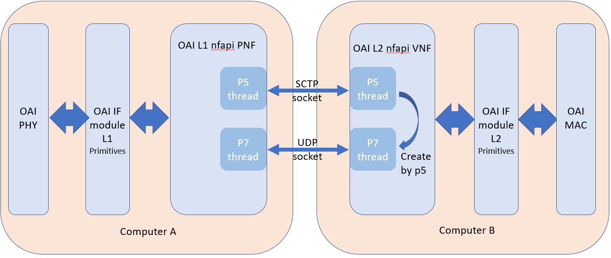

* OSC's phy_stub is bad, need to find a way to utilize OAI's L1, rfSIM, and UE Sim.
* *Integrate OSC-L2 High with OAI-L1 Low* 


\
 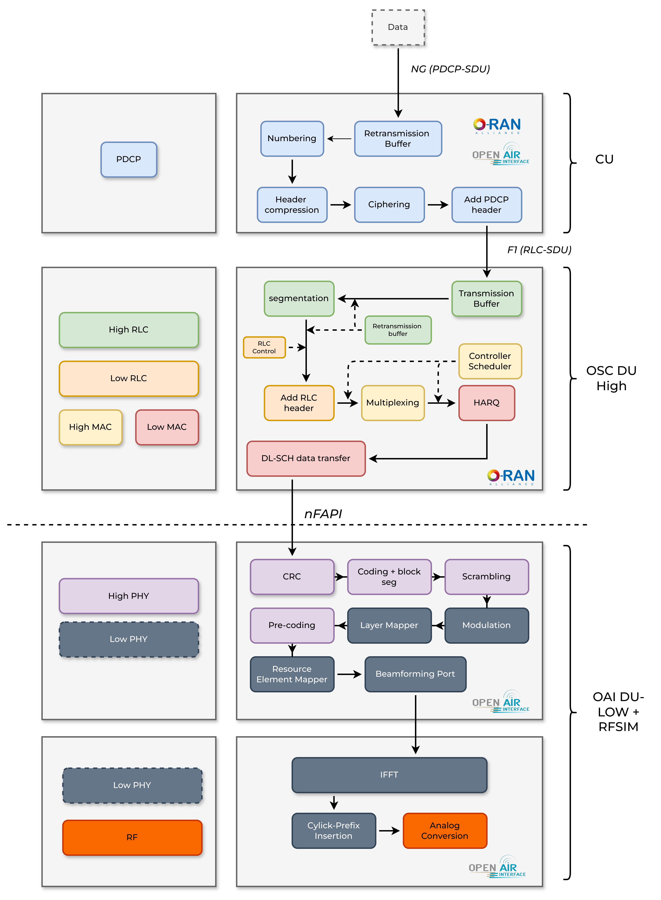

 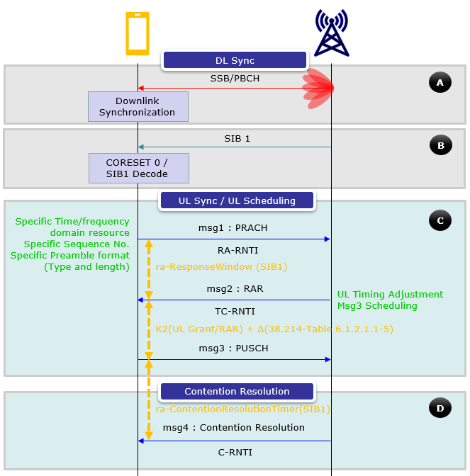 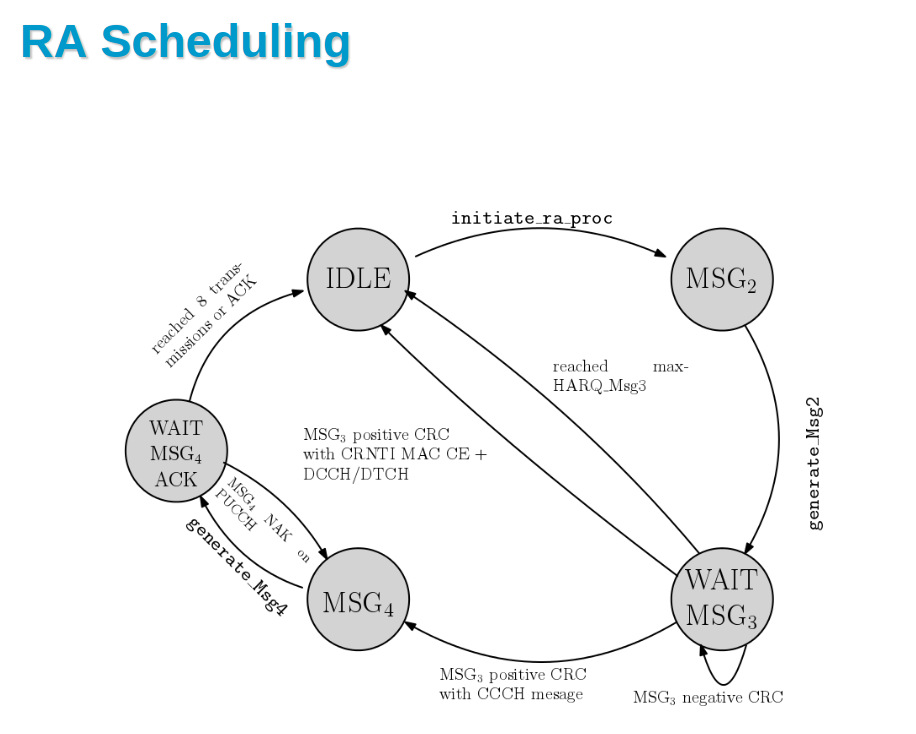


## Integration Process

### Integration Design

| Node | Interface | IP | CNI Driver |
|----|----|----|----|
| AMF | `N2` | 172.2.2.254 | `Whereabouts` |
| UPF | `N3` | 172.2.2.253 | `Multus` |
| OAI-CU | `N2` | - | `Multus` |
| OAI-VNF | `N2` | 172.2.2.10 | `Whereabouts` |
| OAI-VNF | `N3` | 172.2.2.20 | `Whereabouts` |
| OAI-PNF | `F1` | - |    |


**UE Data**

> Make sure the UE is registered on the UDR


| Param | Value |
|----|----|
| IMSI | `001010000000100` |
| KI | `fec86ba6eb707ed08905757b1bb44b8f` |
| OPC | `C42449363BBAD02B66D16BC975D77CC1` |
| DNN | `oai` |
| SST | `1` |
| SD | `0xFFFFFF ` |


### Integration Tracker

| CU | DU-L2 | DU-L1 | rfSim | UE | Remarks |
|----|----|----|----|----|----|
| OAI-CU | OAI-DU-L2 | OAI-DU-L1 | rfSim | OAI UE | *  **==OnGoing ==**
* OAI Master branch support for nFAPI is not complete
* Need to use Richard & Ming's branch
  * Build automation process success |
|    |    |    |    |    |    |


### Deployment Config


**VNF**

 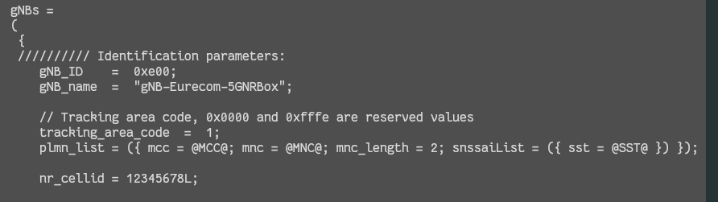

 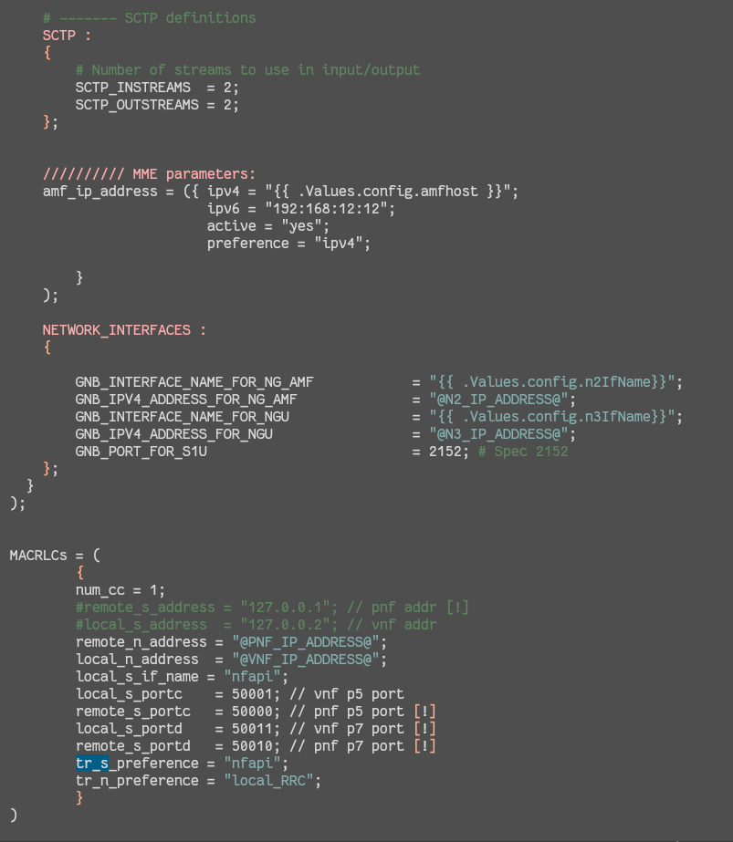

**PNF**

 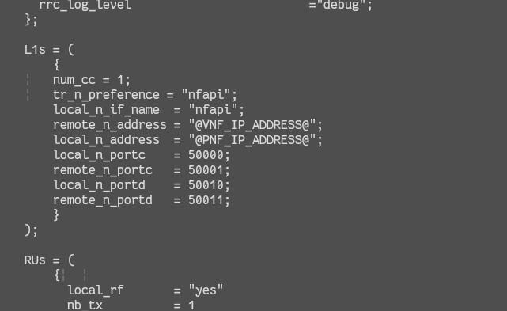

**OAI L1 Command Override** 


```javascript
cd ran_build/build
sudo ./nr-softmodem -O ../../../../OSC_L2/mwnl/oai_pnf_conf/oaiL1.nfapi.usrpb210.conf --sa -E --gNBs.[0].min_rxtxtime 6 --continuous-tx --nfapi 1
```


**OAI CU Command Override**

```javascript
/opt/oai-gnb/bin/nr-softmodem -O /tmp/cu.conf --sa --log_config.global_log_options level nocolor time
```


**OAI-CU (2023.w43) - OSC-DU (master)**


**Failed to decode PDU**

 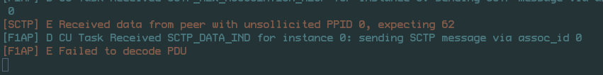

**OAI-CU (Tony) - OSC-DU  (master)**

 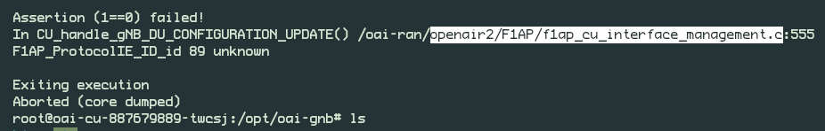

### OAI E2E nFAPI


> `OAI-CU` → `OAI-DU-L2` → `OAI-DU-L1` → `OAI-rfSIM`→ `OAI-nrUE`


 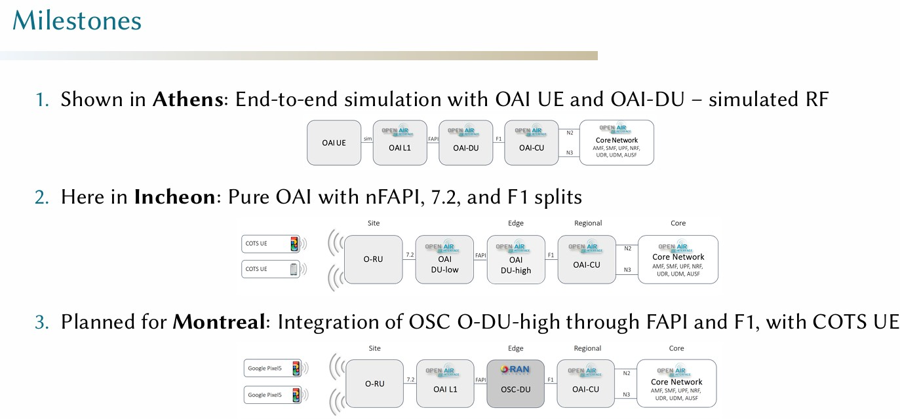


1. Gather the necessary conf files for nFAPI Mode
   - [x] VNF
   - [x] PNF
2. Crete Helm chart 
   - [x] VNF
   - [x] PNF


 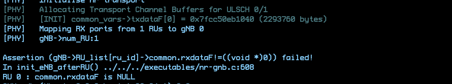

 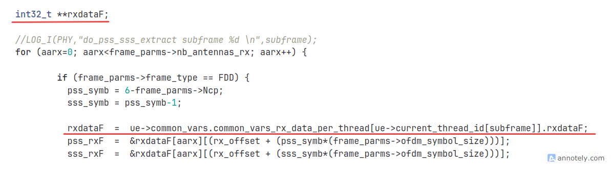

 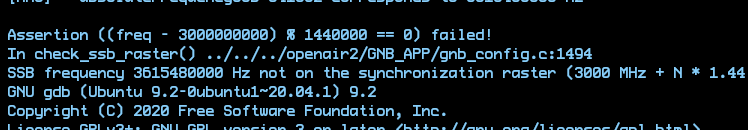

 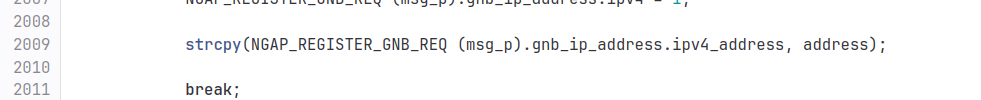

| Param | Default | Updated |
|----|----|----|
| absoluteFrequencySSB | 641032 | *641280* |
| dl_absoluteFrequencyPointA | 640000 | *640008* |


### **ToDo** 


### Tony's version of OAI-CU & OSC-DU-L2

Tony's approach is to change OAI-CU's F1AP codec format according to OSC-CU. Need to reconsider this approach in the future as this approach will need always need a custom OAI-CU patched version to integrate with OSC-DU-L2


1. Git pull ***latest*** OAI-CU
2. Apply tony's patch on ***latest*** OAI-CU

   
   1. Find a way to compare tony's change on OAI-CU with the upstream code.
   2. `Tested` : Incompatible, many missing files and struct. 

   \

### Automate Testing Cycle

- [x] Gather ready to use codes from scattered repos
- [x] Automate build process relevant code base using docker
- [x] Host builds with different tags

  \
  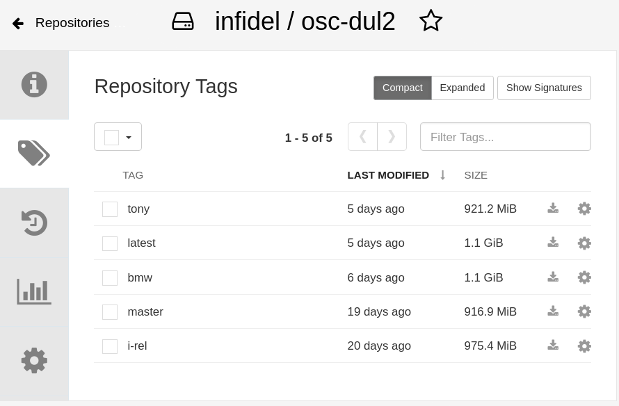
- [ ] Deploy builds on kubernetes 


## Create Build Pipeline nFAPI OAI 


 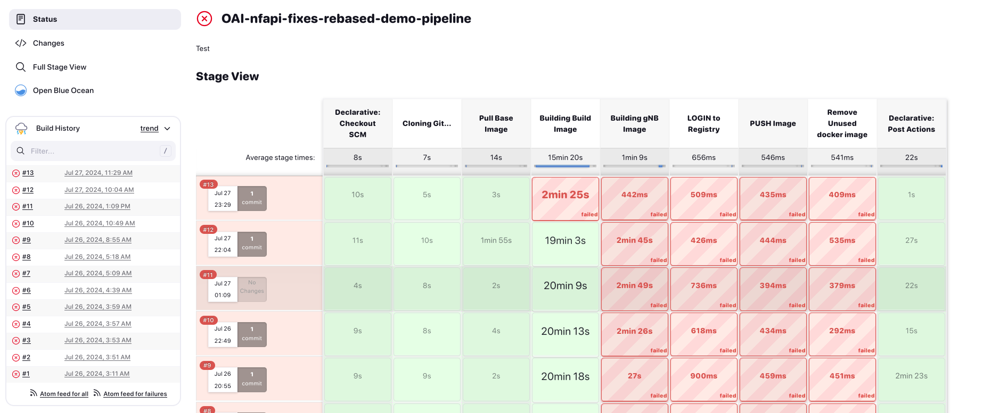

- [x] Create pipeline for build process

  
  1. <https://github.com/motangpuar/bmw-jenkins-build-patches>
  2. <https://jenkins.bmw.lab/view/nFAPI/job/OAI-nfapi-fixes-rebased-demo-pipeline/>
- [x] Automate build

  
  1. Build pipeline success

     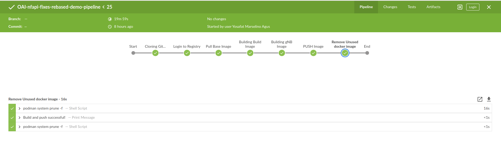
  2. Ready to use custom OAI images

     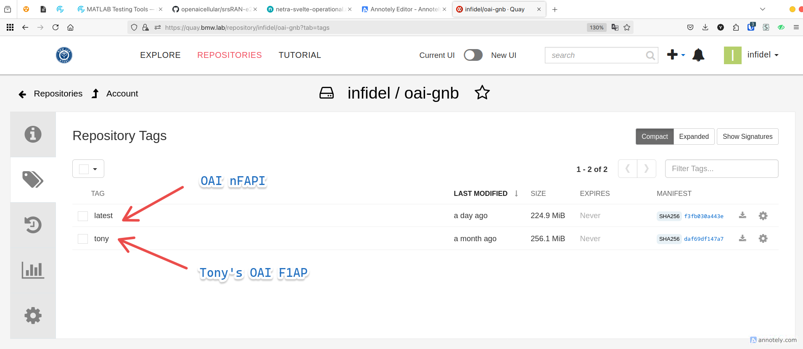

     \
- [x] patch build issues

  
  1. Failed build process without correct flags
  2. Wrong dependencies on build docker container


- [x] Missing libraries \[ **SOLVED \]**

  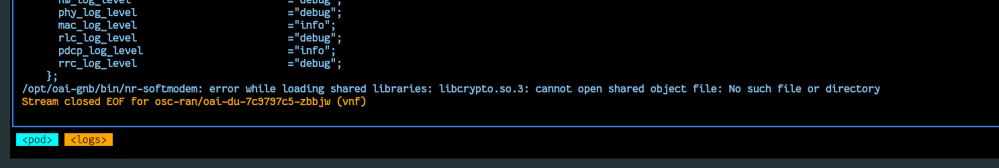


- [x] Integration OAI-VNF & OAI-PNF

  
  1. SCTP connection issue \[ **August 5, 2024** \] 

     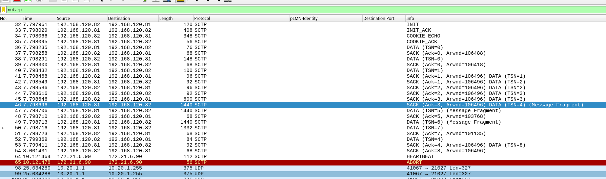


\
## Automatic Integration & Deployment ( Post Development)


### CI: OAI-nFAPI


:::info
CI : <https://jenkins.bmw.lab/view/nFAPI/>

:::


 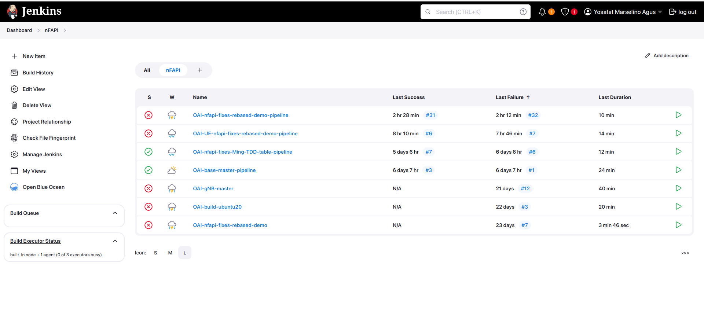

### ArgoCD : VNF, PNF+rfSIM & nr-UE


:::info
CD Repo: <https://github.com/motangpuar/bmw-cicd-manifests>

:::


 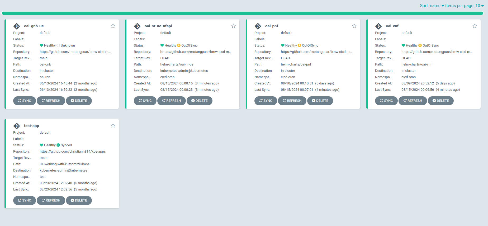


1. AMF

   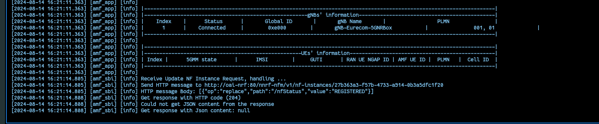
2. VNF

   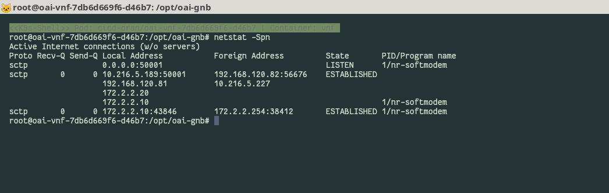
3. PNF+rfSIM

   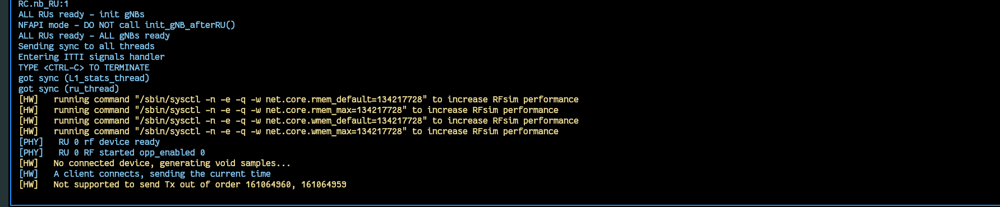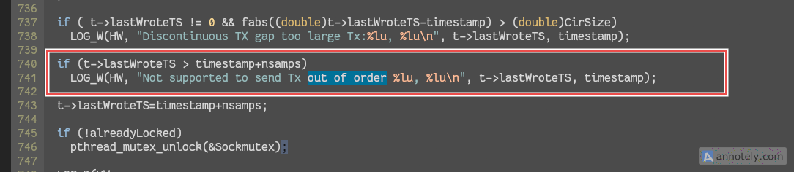
4. **nr-UE** ( Failed to sync timeframe and decode Mib from rfSIM )

   \
   

   >  **==FIXED== :** Wrong config file and execution mode
   > * *PNF Exec Command*
   >
   >   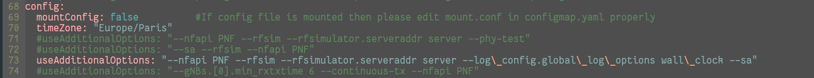
   > * *VNF Config*
   >
   >   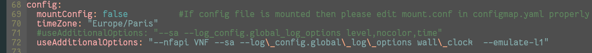
   > * UE 
   >
   >   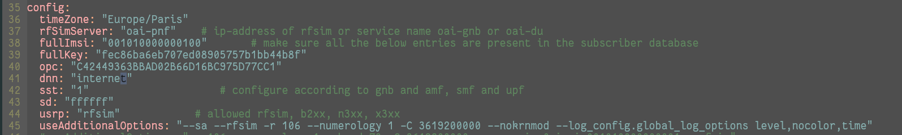

   \
   \
5. SMF : PDU Request detected

   \
   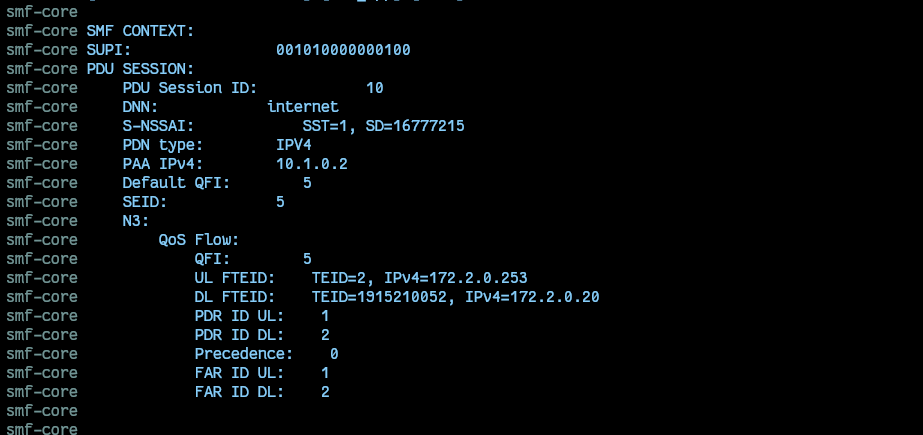

   > *Make sure the VNF n3 interface address are on the same subnet with the UPF n3* 

   \
   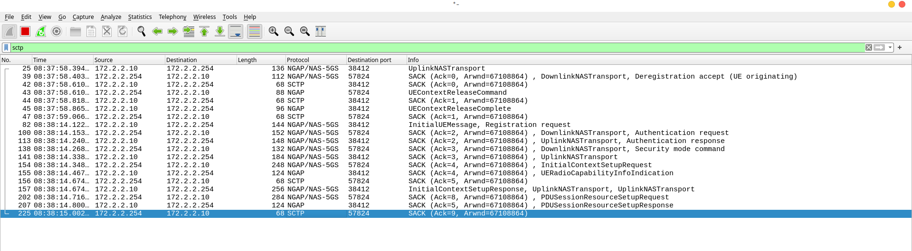

 

 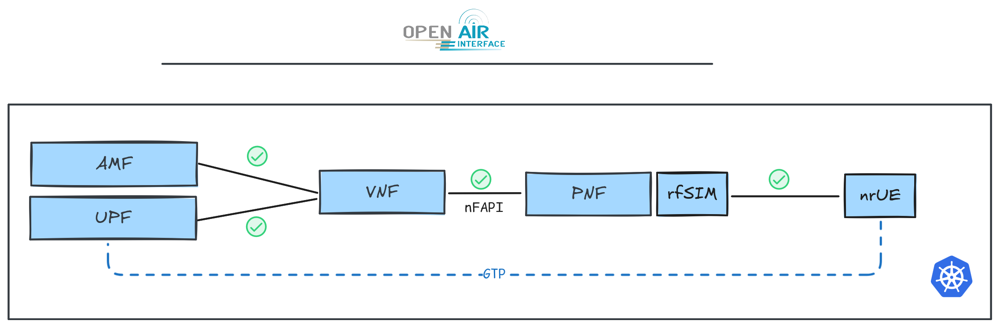

> **Attach PCAP**
>
> [nFAPI-K8S.pcapng 3601928](attachments/f989bf0d-e43f-418f-91f8-fa9e439c231e.false)

> \


\
## References

* [Integration Manual](https://hackmd.io/kJDv7rgISu-VrbkH-ShXTw)


* Functional Split

  [HUBER-SUHNER-Cube-Optics-Functional-Split-Rev03.pdf 204406](attachments/ccc67837-6080-43df-852f-b0dd82076036.pdf)

* *==Richard & Ming's Work==*

  [https://hackmdming.io/@Mi50010ngHung/StudyBook/%2F%40MingHung%2FOAI_DU](https://hackmd.io/@MingHung/StudyBook/%2F%40MingHung%2FOAI_DU)
* …


\